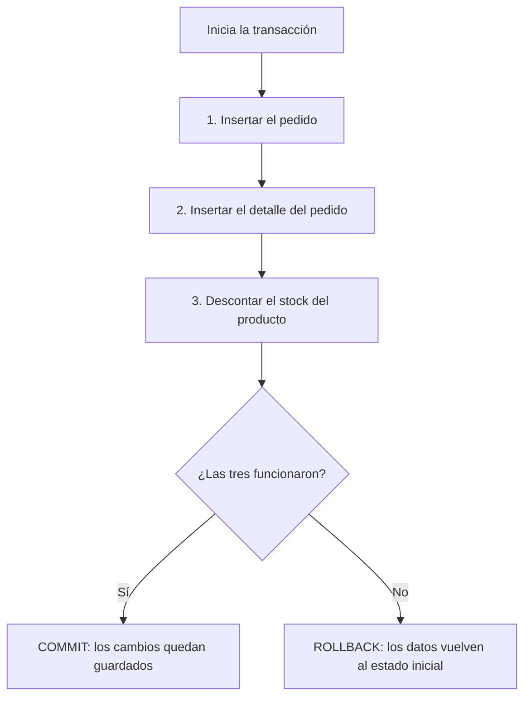
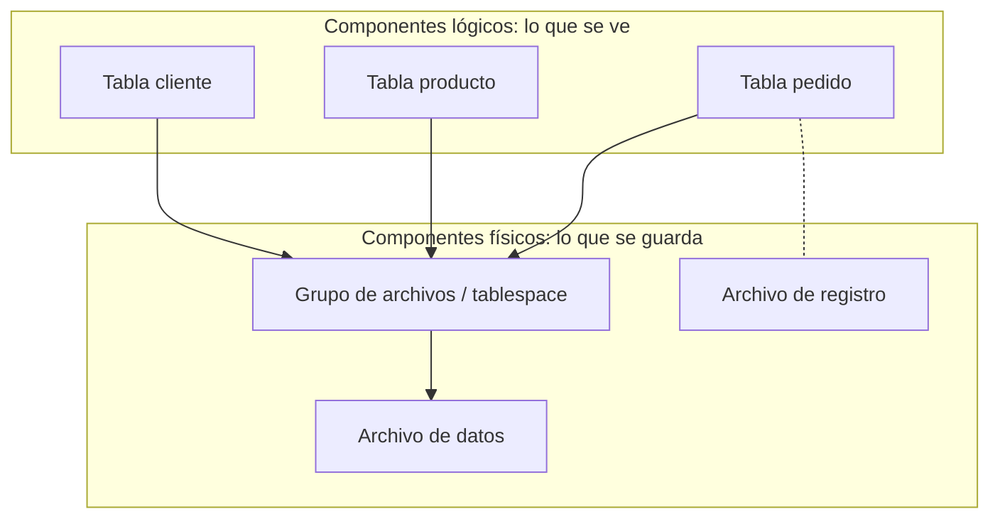
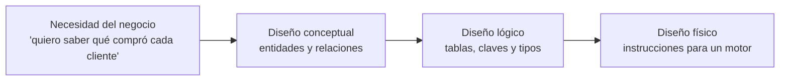
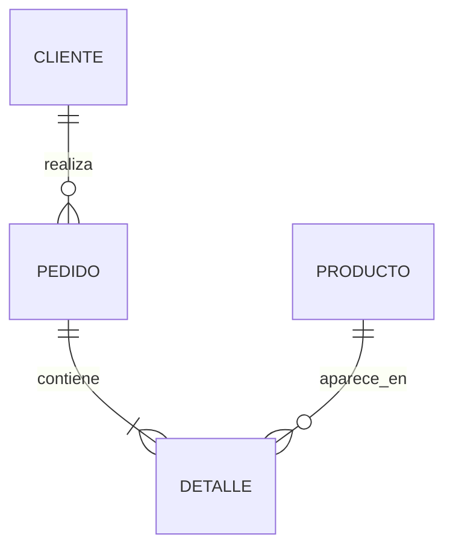

# Sesión 1: Conceptos generales de bases de datos relacionales

## 1. Datos de la sesión

- **Unidad:** Introducción y diseño de modelo de datos
- **Semana:** 1
- **Duración:** 90 minutos
- **Modalidad:** Virtual en vivo

## 2. Logro

Al finalizar la sesión, el estudiante explica qué es una base de datos relacional, reconoce la redundancia y las reglas de integridad, distingue los componentes lógicos de los físicos y ubica un mismo caso en los diseños conceptual, lógico y físico.

## 3. Forma de trabajo

Cada bloque sigue esta secuencia:

**concepto breve → ejemplo realista preparado con IA → decisión de los estudiantes → conclusión**

Ningún término se utiliza antes de haber sido definido. Cada bloque de teoría presenta las palabras en el orden en que se necesitan, de la más simple a la más compuesta, y recién después aparece la práctica.

La IA ayuda al docente a preparar **mini-sistemas web funcionales**. Cada uno debe sentirse como una aplicación real: tiene una interfaz completa para su propósito, datos coherentes, validaciones, cambios de estado y retroalimentación. Sin embargo, solo implementa el flujo necesario para demostrar un concepto de la sesión.

Cada mini-sistema se entrega como un único archivo HTML que los estudiantes pueden descargar y abrir directamente en su navegador. No requiere instalación, servidor ni dependencias externas.

### Motor utilizado en las prácticas

Los mini-sistemas incluyen **SQLite** incrustado dentro del mismo archivo HTML.

- **Motor de base de datos (SGBD):** programa que guarda los datos, los organiza y responde a las consultas. También se le llama sistema gestor de base de datos.
- **SQLite:** motor que guarda toda la base de datos en un solo archivo y se ejecuta dentro de la propia aplicación, sin servidor ni instalación.

Se eligió SQLite porque permite que el estudiante ejecute instrucciones reales desde la primera semana y porque hace visible una idea central de la sesión: **una base de datos es, al final, un archivo en el disco**.

Cuando la sesión requiera hablar de un motor de tipo servidor, la referencia será **MySQL**, que es el que se utilizará más adelante en el curso.

### Caso de estudio

Toda la sesión trabaja sobre la **tienda en línea "La Bodega"**, que vende productos, registra clientes y toma pedidos. Los mismos clientes, productos y pedidos aparecen en las cuatro prácticas.

Todos los mini-sistemas deben mantener el mismo criterio:

- Una interfaz de aplicación web realista y adaptable a computadoras y celulares.
- Fondo claro y tipografía legible.
- Una sola pantalla, sin navegación entre páginas.
- Una sola función principal.
- Datos iniciales realistas y consistentes entre todas las actividades.
- Los mensajes de error deben ser los que devuelve el motor, no textos inventados.
- Un botón discreto para restablecer los datos de demostración.
- Sin secciones decorativas, estadísticas irrelevantes, animaciones ni funciones ajenas al concepto.

## 4. Guion de clase

### 4.1. Problema inicial - 5 minutos

Presentar el caso:

> La tienda "La Bodega" registra sus ventas en una sola hoja de cálculo. Cada fila contiene el pedido, el nombre del cliente, su teléfono, su dirección y el producto vendido. Un cliente que compró once veces aparece once veces. Ayer cambió de dirección y se corrigió solo en tres filas. Hoy nadie sabe a dónde enviar su pedido.

Los estudiantes responden en el chat:

1. ¿Qué información quedó equivocada?
2. ¿Dónde estuvo el error: en la persona que escribió o en la forma de guardar los datos?

Todavía no se presenta la solución. La hoja de cálculo se mantiene visible durante toda la sesión como punto de comparación.

---

### 4.2. Qué es una base de datos relacional - 12 minutos

#### Teoría - 6 minutos

Introducir en este orden, sin adelantar ningún término:

- **Dato:** valor aislado que por sí solo no dice nada. Ejemplo: `1250`.
- **Información:** dato acompañado de su significado. Ejemplo: `el pedido 1250 fue registrado el 12 de agosto`.
- **Archivo plano:** archivo donde los datos se guardan uno detrás de otro, sin reglas que los controlen. Una hoja de cálculo o un archivo de texto funcionan así.
- **Base de datos:** conjunto de datos relacionados entre sí, guardados de forma organizada y con reglas que los protegen.
- **Tabla:** estructura con forma de cuadrícula donde se guarda un solo tipo de cosa. Una tabla para clientes, otra para productos.
- **Columna:** cada una de las características que guarda la tabla. También se le llama campo o atributo. Ejemplo: `nombre`, `precio`.
- **Fila:** cada uno de los elementos concretos guardados en la tabla. También se le llama registro o tupla. Ejemplo: un cliente específico.
- **Clave primaria:** columna cuyo valor no se repite nunca y que sirve para identificar una fila sin confusión. Ejemplo: `id_cliente`.
- **Base de datos relacional:** base de datos organizada en tablas que se conectan entre sí a través de sus claves.
- **SQL:** lenguaje con el que se le pide al motor guardar, modificar o consultar datos.

Mostrar la diferencia sobre el caso:

| Hoja de cálculo | Base de datos relacional |
|---|---|
| Cualquiera escribe cualquier cosa en cualquier celda | El motor rechaza lo que no cumple las reglas |
| El cliente se repite en cada fila | El cliente se guarda una sola vez |
| Corregir un dato exige revisar todas las filas | Corregir un dato se hace en un solo lugar |
| Los datos se leen a ojo | Los datos se consultan con SQL |

Presentar después los **motores más usados**, indicando la única distinción que importa hoy:

- **Motor embebido:** vive dentro de la aplicación y guarda todo en un archivo.
- **Motor cliente-servidor:** es un programa que se ejecuta aparte y atiende a varias aplicaciones al mismo tiempo por la red.

| Motor | Tipo | Uso habitual |
|---|---|---|
| **SQLite** | Embebido | Aplicaciones móviles, de escritorio y aprendizaje |
| **MySQL** | Cliente-servidor | Aplicaciones web |
| **PostgreSQL** | Cliente-servidor | Aplicaciones con reglas y consultas complejas |
| **SQL Server** | Cliente-servidor | Entornos empresariales sobre tecnología Microsoft |
| **Oracle Database** | Cliente-servidor | Sistemas corporativos de gran tamaño |

#### Práctica con IA: consultar una tabla real - 6 minutos

Cada estudiante abre el mini-sistema, observa la hoja de cálculo de la tienda y la misma información ya separada en tablas. Después ejecuta consultas ya escritas y solo presiona un botón para ver el resultado:

```sql
SELECT nombre, precio FROM producto;
SELECT nombre, telefono FROM cliente;
```

Los estudiantes responden:

1. ¿Cuántas veces aparece el mismo cliente en la hoja de cálculo y cuántas veces en la tabla `cliente`?
2. Si el cliente cambia de teléfono, ¿cuántos lugares hay que corregir en cada caso?
3. ¿Qué columna permite reconocer a un cliente aunque dos personas tengan el mismo nombre?

**Prompt para preparar el recurso:**

> Construye una pantalla web minimalista y funcional para comparar una hoja de cálculo con una base de datos relacional. Entrega un solo archivo HTML con CSS y JavaScript integrados, con el motor SQLite incrustado en el mismo archivo, sin dependencias externas ni conexión a internet.
>
> En la mitad izquierda, muestra una tabla plana de ventas de una tienda con doce filas, al estilo de una hoja de cálculo: pedido, nombre del cliente, teléfono, dirección, producto, precio y cantidad. El mismo cliente debe repetirse en varias filas con el teléfono escrito de forma distinta en una de ellas.
>
> En la mitad derecha, muestra la misma información ya separada en las tablas cliente, producto y pedido, con su clave primaria visible. Debajo, incluye tres botones que ejecuten consultas ya escritas sobre SQLite y muestren el resultado en una tabla: listar productos, listar clientes y contar cuántas veces aparece cada cliente en cada representación.
>
> Usa precios en soles y un botón Restablecer. No incluyas editor de SQL libre, gráficos, menú, login ni explicaciones teóricas en pantalla. Debe funcionar al abrir el archivo directamente en el navegador.

**Conclusión:** una base de datos relacional guarda cada cosa una sola vez, en su propia tabla, y las conecta mediante claves.

---

### 4.3. Redundancia e integridad - 14 minutos

#### Teoría - 6 minutos

Introducir en este orden:

- **Redundancia:** repetición innecesaria del mismo dato en varios lugares.
- **Anomalía:** problema que aparece al trabajar con datos redundantes. Hay tres:
  - **De actualización:** se corrige el dato en un lugar y queda equivocado en los demás.
  - **De inserción:** no se puede registrar algo porque falta información de otra cosa distinta.
  - **De eliminación:** al borrar una fila se pierde información que nadie más guardaba.
- **Integridad de los datos:** garantía de que los datos guardados son correctos, completos y coherentes entre sí.
- **Restricción:** regla que el motor aplica antes de aceptar un dato. Si la regla no se cumple, el motor rechaza la operación.

Presentar las tres formas de integridad exactamente sobre el caso de la tienda:

| Forma de integridad | Qué garantiza | Regla en la tienda |
|---|---|---|
| **De entidad** | Cada fila se distingue de las demás | `id_cliente` no se repite ni queda vacío |
| **De dominio** | Cada dato tiene el tipo y el rango correctos | `precio` es numérico y mayor que cero |
| **Referencial** | Una fila no apunta a algo que no existe | Un pedido no puede pertenecer a un cliente inexistente |

Introducir recién aquí el término que hace posible la integridad referencial:

- **Clave foránea:** columna de una tabla que guarda la clave primaria de otra tabla, y con la cual se conectan ambas. Ejemplo: `pedido.id_cliente` apunta a `cliente.id_cliente`.

#### Práctica con IA: provocar el rechazo del motor - 8 minutos

Cada estudiante abre el mini-sistema e intenta ejecutar cuatro operaciones que rompen alguna regla. En cada intento aparece el mensaje real de SQLite.

```text
Registrar un cliente con un id_cliente que ya existe   → integridad de entidad
Registrar un producto con precio -20                   → integridad de dominio
Registrar un pedido del cliente 999, que no existe     → integridad referencial
Eliminar un cliente que tiene pedidos registrados      → integridad referencial
```

Los estudiantes responden:

1. ¿Qué regla rechazó cada operación?
2. ¿Cuál de esas cuatro operaciones habría sido aceptada sin ningún aviso en la hoja de cálculo del problema inicial?
3. Si el motor no rechazara el tercer caso, ¿a nombre de quién quedaría el pedido?

Después cambian la dirección del cliente que compró once veces y comprueban que basta una sola corrección.

**Prompt para preparar el recurso:**

> Construye una pantalla web minimalista y funcional para demostrar integridad y redundancia en una base de datos. Entrega un solo archivo HTML con CSS y JavaScript integrados, con el motor SQLite incrustado en el mismo archivo, sin dependencias externas ni conexión a internet.
>
> Crea las tablas cliente, producto y pedido con clave primaria, una restricción de precio mayor que cero y una clave foránea de pedido hacia cliente, con las claves foráneas activadas. Carga cuatro clientes, cuatro productos y seis pedidos coherentes.
>
> Muestra las tres tablas en pantalla y, debajo, cuatro botones que intenten: insertar un cliente con un identificador repetido, insertar un producto con precio negativo, insertar un pedido de un cliente inexistente y eliminar un cliente que tiene pedidos. Cada intento debe mostrar el mensaje de error tal como lo devuelve SQLite, junto al nombre de la regla que se violó, y las tablas deben quedar sin cambios.
>
> Incluye además un formulario para cambiar la dirección de un cliente, que actualice una sola fila y refresque las tablas. Usa un botón Restablecer. No incluyas editor de SQL libre, menú, login, gráficos ni explicaciones teóricas en pantalla. Debe funcionar al abrir el archivo directamente en el navegador.

**Conclusión:** la redundancia es lo que permite que los datos se contradigan; las restricciones son lo que impide que eso ocurra.

---

### 4.4. Componentes lógicos: registro de datos y transacciones - 12 minutos

#### Teoría - 6 minutos

Explicar primero la distinción que ordena este bloque y el siguiente:

- **Componente lógico:** lo que el usuario y el programador ven y manipulan: tablas, filas, columnas, consultas.
- **Componente físico:** lo que el motor guarda en el disco: archivos.

Introducir después los componentes lógicos en este orden:

- **Registro de datos:** una fila completa de una tabla, con todos sus campos. Es la unidad mínima que se guarda o se recupera.
- **Operación:** una sola instrucción sobre los datos: insertar, modificar, eliminar o consultar.
- **Transacción:** conjunto de operaciones que deben ejecutarse todas o ninguna, porque juntas representan un solo hecho del negocio.
- **Confirmar (COMMIT):** aceptar de forma definitiva todos los cambios de la transacción.
- **Deshacer (ROLLBACK):** cancelar todos los cambios de la transacción y dejar los datos como estaban antes de empezar.
- **Registro de transacciones (log):** archivo donde el motor anota cada cambio antes de aplicarlo, para poder deshacerlo o recuperarlo si el sistema falla.

Advertir la coincidencia de nombres, porque confunde a menudo: **registro de datos** es una fila; **registro de transacciones** es una bitácora de cambios.

Mostrar el caso concreto: registrar un pedido en la tienda son tres operaciones que forman una sola transacción.



Nombrar aquí las cuatro propiedades que el motor garantiza en una transacción, sin desarrollarlas:

- **Atomicidad:** se ejecutan todas las operaciones o ninguna.
- **Consistencia:** la base de datos queda cumpliendo todas sus reglas.
- **Aislamiento:** una transacción no ve los cambios a medias de otra.
- **Durabilidad:** lo confirmado sobrevive a un corte de energía.

#### Práctica con IA: confirmar y deshacer una transacción - 6 minutos

Cada estudiante registra un pedido en el mini-sistema con dos modos disponibles:

1. **Modo normal:** las tres operaciones funcionan y la transacción se confirma.
2. **Modo con falla:** la tercera operación falla porque el stock es insuficiente.

Los estudiantes responden:

1. En el modo con falla, ¿quedó registrado el pedido? ¿Y el detalle?
2. ¿Qué habría pasado con el stock si el motor hubiera guardado solo las dos primeras operaciones?
3. ¿Por qué las tres operaciones tienen que formar una sola transacción y no tres separadas?

**Prompt para preparar el recurso:**

> Construye una pantalla web minimalista y funcional para demostrar transacciones en una base de datos. Entrega un solo archivo HTML con CSS y JavaScript integrados, con el motor SQLite incrustado en el mismo archivo, sin dependencias externas ni conexión a internet.
>
> Usa las tablas cliente, producto, pedido y detalle_pedido de una tienda, con los mismos clientes y productos de las demás actividades. Registrar un pedido debe ejecutar dentro de una transacción: insertar el pedido, insertar el detalle y descontar el stock.
>
> En una sola pantalla, muestra un selector de cliente, un selector de producto, una cantidad y un botón Registrar pedido, además de las tablas de productos con su stock y de pedidos. Incluye una casilla "Simular falla en el descuento de stock" que haga fallar la tercera operación y provoque un ROLLBACK.
>
> Debajo, muestra una bitácora que liste en orden cada operación ejecutada y el resultado final de la transacción: COMMIT o ROLLBACK. Después de un ROLLBACK, las tablas deben quedar exactamente como estaban. Añade un botón "Descargar la base de datos" que exporte el archivo .db, y un botón Restablecer. No incluyas editor de SQL libre, menú, login, pagos ni gráficos. Debe funcionar al abrir el archivo directamente en el navegador.

**Conclusión:** una transacción convierte varias operaciones en un solo hecho que ocurre completo o no ocurre.

---

### 4.5. Componentes físicos: archivos y grupos de archivos - 8 minutos

#### Teoría - 6 minutos

Retomar la definición de componente físico y bajar al disco. Introducir en este orden:

- **Archivo de datos:** archivo del disco donde el motor guarda las tablas y sus contenidos.
- **Archivo de registro:** archivo donde el motor guarda el registro de transacciones, es decir, los cambios antes de aplicarlos.
- **Grupo de archivos:** conjunto de archivos de datos tratados como una sola unidad, de modo que se puede indicar en qué grupo se guarda cada tabla. Sirve para repartir tablas grandes entre varios discos y para respaldar solo una parte de la base de datos. En MySQL este concepto se llama **tablespace** o espacio de tablas; en SQL Server se llama **filegroup**.

Mostrar el mismo concepto en los dos motores de la sesión:

| Concepto | SQLite | MySQL (InnoDB) |
|---|---|---|
| Archivo de datos | Un único archivo `tienda.db` | Un archivo `.ibd` por tabla, dentro del directorio de datos |
| Archivo de registro | Archivo temporal `tienda.db-journal` o `-wal` | Archivos de rehacer (*redo log*) |
| Grupo de archivos | No existe: todo vive en un solo archivo | *Tablespace*, que puede agrupar varias tablas |
| Dónde se administra | Copiando o moviendo el archivo | Con instrucciones SQL sobre el servidor |



#### Práctica: ver la base de datos como archivo - 2 minutos

Con el mini-sistema del bloque anterior, cada estudiante presiona **Descargar la base de datos**, guarda el archivo `.db` y observa su tamaño. Después registra tres pedidos más, vuelve a descargarlo y compara.

Los estudiantes responden:

1. ¿Qué ocurrió con el tamaño del archivo?
2. Si ese archivo se copia a otra computadora, ¿qué se llevó consigo?
3. En MySQL, ¿bastaría con copiar un archivo para llevarse la base de datos?

**Conclusión:** las tablas son la vista lógica de algo que en el disco siempre son archivos, y el motor decide cómo repartirlos.

---

### 4.6. Del caso real al modelo: diseño conceptual, lógico y físico - 14 minutos

#### Teoría - 7 minutos

Introducir primero las piezas del modelo:

- **Entidad:** cosa del mundo real sobre la que la organización necesita guardar información. Ejemplo: cliente, producto, pedido.
- **Atributo:** característica de una entidad. Ejemplo: el nombre del cliente.
- **Instancia:** un caso concreto de una entidad. Ejemplo: la clienta Rosa Díaz.
- **Relación:** vínculo con sentido entre dos entidades. Ejemplo: un cliente **realiza** un pedido.
- **Cardinalidad:** cuántas instancias de una entidad pueden vincularse con cuántas de la otra.

Presentar los tres tipos de cardinalidad sobre la tienda:

| Cardinalidad | Significado | Ejemplo en la tienda |
|---|---|---|
| **Uno a uno (1:1)** | Una instancia se vincula con una sola | Un cliente tiene una sola cuenta de acceso |
| **Uno a muchos (1:N)** | Una instancia se vincula con varias | Un cliente realiza muchos pedidos |
| **Muchos a muchos (N:M)** | Varias se vinculan con varias | Un pedido incluye muchos productos y un producto aparece en muchos pedidos |

Introducir después los tres niveles de diseño, que son el mismo modelo visto con distinto grado de detalle:

- **Diseño conceptual:** identifica entidades, atributos y relaciones. Se escribe en el lenguaje del negocio y no depende de ningún motor.
- **Diseño lógico:** convierte ese modelo en tablas, con sus claves primarias y foráneas y sus tipos de datos generales. Todavía no depende de ningún motor.
- **Diseño físico:** escribe las instrucciones concretas para un motor determinado, con sus tipos de datos, índices y archivos.



Mostrar el modelo conceptual de la tienda:



Explicar por qué aparece `DETALLE`: una relación de muchos a muchos no se puede guardar directamente en dos tablas, así que se convierte en una tabla intermedia. Este es el primer ejemplo de una decisión que se toma al pasar del diseño conceptual al lógico.

Cerrar con la equivalencia entre los tres niveles:

| Diseño conceptual | Diseño lógico | Diseño físico (SQLite) |
|---|---|---|
| Entidad `CLIENTE` | Tabla `cliente` | `CREATE TABLE cliente (...)` |
| Atributo `nombre` | Columna `nombre`, texto | `nombre TEXT NOT NULL` |
| Identificador del cliente | Clave primaria `id_cliente` | `id_cliente INTEGER PRIMARY KEY` |
| Relación `realiza` | Clave foránea en `pedido` | `FOREIGN KEY (id_cliente) REFERENCES cliente(id_cliente)` |

#### Práctica con IA: recorrer los tres niveles - 7 minutos

Cada estudiante lee el enunciado de la tienda dentro del mini-sistema y marca en el texto qué palabras son entidades y cuáles son atributos. El sistema corrige la selección. Después elige la cardinalidad de cada relación y, al final, ve generado el modelo lógico y las instrucciones físicas correspondientes a sus decisiones.

Los estudiantes responden:

1. ¿Por qué `dirección` es un atributo y no una entidad en este caso?
2. ¿Qué cardinalidad une el pedido con el producto y qué tabla obliga a crear?
3. Si mañana la tienda cambia de SQLite a MySQL, ¿cuál de los tres diseños tendría que rehacerse?

**Prompt para preparar el recurso:**

> Construye una pantalla web minimalista y funcional para recorrer el diseño conceptual, lógico y físico de una base de datos. Entrega un solo archivo HTML con CSS y JavaScript integrados, con el motor SQLite incrustado en el mismo archivo, sin dependencias externas ni conexión a internet.
>
> Muestra arriba el enunciado de una tienda en línea que vende productos, registra clientes y toma pedidos con varios productos cada uno. En el paso 1, el estudiante marca palabras del enunciado como entidad o atributo, y el sistema indica cuáles acertó. En el paso 2, elige la cardinalidad de cliente-pedido y de pedido-producto entre 1:1, 1:N y N:M, y el sistema explica en una línea por qué la relación N:M necesita una tabla intermedia.
>
> En el paso 3, muestra el modelo lógico resultante como una lista de tablas con sus claves primarias y foráneas. En el paso 4, muestra las instrucciones CREATE TABLE correspondientes, ejecútalas realmente en SQLite e informa si se crearon sin error.
>
> Usa un solo panel con los cuatro pasos en secuencia, un botón Siguiente y un botón Restablecer. No incluyas editor de SQL libre, arrastre de figuras, menú, login ni teoría extensa en pantalla. Debe funcionar al abrir el archivo directamente en el navegador.

**Conclusión:** el diseño conceptual describe el negocio, el lógico lo convierte en tablas y el físico lo escribe para un motor concreto. Cambiar de motor solo obliga a rehacer el último nivel.

---

### 4.7. Herramientas de modelamiento - 6 minutos

#### Teoría - 6 minutos

Introducir primero el término:

- **Herramienta de modelamiento:** programa que permite dibujar el modelo de datos y, en varios casos, generar automáticamente las instrucciones del diseño físico a partir del dibujo.
- **Ingeniería inversa:** función que hace el camino contrario, es decir, se conecta a una base de datos existente y dibuja su modelo.

| Herramienta | Tipo | Genera SQL | Ingeniería inversa | Costo |
|---|---|---|---|---|
| **dbdiagram.io** | Web | Sí | Limitada | Gratuita con cuenta |
| **MySQL Workbench** | Escritorio | Sí | Sí | Gratuita |
| **ERDPlus** | Web | Sí | No | Gratuita |
| **draw.io** | Web y escritorio | No | No | Gratuita |
| **DBeaver** | Escritorio | Sí | Sí | Versión gratuita |
| **SQL Server Management Studio** | Escritorio | Sí | Sí | Gratuita |

Indicar el criterio de elección, que es lo único que se evalúa:

- Para **dibujar rápido** y compartir un modelo en clase: dbdiagram.io.
- Para **trabajar contra el motor** que se usará en el curso: MySQL Workbench o DBeaver.
- Para un **diagrama de documentación** sin conexión a ninguna base de datos: draw.io.

Mostrar en vivo el mismo modelo de la tienda en dbdiagram.io y generar su SQL. Es la única demostración del docente en la sesión.

**Conclusión:** la herramienta dibuja y genera código, pero las entidades, las relaciones y las cardinalidades las decide quien diseña.

---

### 4.8. Cierre y tarea - 4 minutos

Cada estudiante prepara, para la sesión 2:

1. Un **modelo conceptual propio**: elegir un negocio pequeño y conocido, distinto de una tienda, y escribir sus entidades, sus atributos y sus relaciones con la cardinalidad de cada una. Basta una lista escrita o una foto de un dibujo a mano.
2. La **versión estable más reciente** de SQLite, MySQL, PostgreSQL y SQL Server, con su fecha de publicación.

Debe registrarse el **enlace oficial** de donde se obtuvo cada versión: las versiones cambian con frecuencia y la fuente forma parte de la respuesta. La revisión abre la sesión 2, donde el modelo entregado se convertirá en un diagrama entidad-relación con notación Chen y Crow's Foot.

## 5. Distribución del tiempo

| Momento | Duración |
|---|---:|
| Problema inicial | 5 minutos |
| Qué es una base de datos relacional | 12 minutos |
| Redundancia e integridad | 14 minutos |
| Componentes lógicos: registro de datos y transacciones | 12 minutos |
| Componentes físicos: archivos y grupos de archivos | 8 minutos |
| Diseño conceptual, lógico y físico | 14 minutos |
| Herramientas de modelamiento | 6 minutos |
| Cierre y tarea | 4 minutos |
| **Suma de los bloques** | **75 minutos** |

Quedan 15 minutos de margen respecto de los 90 de la sesión. Sirven para ampliar las prácticas de integridad y de diseño, que son las que más se alargan con estudiantes que ven bases de datos por primera vez.

## 6. Evidencias

- Comparación entre la hoja de cálculo y las tablas de la tienda.
- Identificación de la regla de integridad que rechazó cada operación.
- Bitácora de una transacción confirmada y de una transacción deshecha.
- Archivo `.db` descargado antes y después de registrar pedidos.
- Entidades, atributos y cardinalidades marcadas sobre el enunciado.
- Tarea: modelo conceptual de un negocio propio y versiones de los motores, con su fuente.

## 7. Preparación del docente

1. Generar los cuatro archivos HTML indicados en el guion, con SQLite incrustado en cada uno.
2. Abrirlos sin servidor y comprobar que funcionen sin conexión a internet.
3. Verificar que las claves foráneas estén activadas: en SQLite se desactivan por omisión y sin ellas la práctica de integridad referencial no rechaza nada.
4. Comprobar que los clientes, productos y pedidos sean idénticos en los cuatro archivos.
5. Compartirlos con los estudiantes antes de iniciar cada práctica.
6. Mantener nombres simples: `tablas.html`, `integridad.html`, `transacciones.html` y `modelado.html`.
7. Tener el modelo de la tienda ya cargado en dbdiagram.io antes de la clase.
8. Conservar capturas estáticas por si algún estudiante no puede ejecutar un archivo.

## 8. Alcance

Esta sesión llega hasta el reconocimiento de entidades, relaciones y cardinalidades, y hasta la distinción entre los tres niveles de diseño. El **modelo entidad-relación con notación Chen y Crow's Foot** se desarrolla en la semana 2. La **transformación al modelo lógico relacional**, con claves compuestas y dependencias funcionales, corresponde a la semana 3, y la **normalización** a las semanas 4 y 5, como establece el sílabo. En esta sesión no se escriben consultas propias: el lenguaje SQL se trabaja desde la unidad 2.
