# Caso guía: la tienda en línea

Todo el material usa un mismo caso de fondo. La ventaja pedagógica es que el alumno no
tiene que reaprender un ejemplo nuevo en cada concepto: siempre es la misma tienda,
vista desde otro ángulo.

## Modelo de datos base

| Tabla | Clave primaria | Atributos | Clave foránea |
|---|---|---|---|
| `CLIENTES` | `id_cliente` | nombre, correo, dirección, teléfono | — |
| `PEDIDOS` | `id_pedido` | fecha, estado, total | `id_cliente` → CLIENTES |
| `DETALLE_PEDIDO` | `id_detalle` | cantidad, precio_unitario | `id_pedido` → PEDIDOS, `id_producto` → PRODUCTOS |
| `PRODUCTOS` | `id_producto` | nombre, precio, stock | `id_categoria` → CATEGORIAS |
| `CATEGORIAS` | `id_categoria` | nombre, descripción | — |

## Relaciones

- Un **cliente** realiza muchos **pedidos** (1:N).
- Un **pedido** contiene muchas **líneas de detalle** (1:N).
- Un **producto** figura en muchas líneas de detalle (1:N).
- Una **categoría** clasifica muchos **productos** (1:N).

`DETALLE_PEDIDO` es la tabla que **resuelve el M:N** entre pedidos y productos. Vale la pena
detenerse ahí en clase: los alumnos suelen dibujar una flecha directa entre PEDIDO y
PRODUCTO y no entienden dónde poner la cantidad.

## Personajes y datos recurrentes

Úsalos siempre iguales para que los alumnos los reconozcan de un slide a otro:

- **Ana**, `id_cliente = 7`.
- **Pedido 1024**, del 15/03/2026.
- **Producto 88 – Audífonos X**: precio hoy S/ 300, comprado en marzo a S/ 250, stock 42.

Ese desfase entre S/ 250 y S/ 300 es el que hace visible el tema de la redundancia
intencional (ver slide 19) y no es casualidad que aparezca en varios diagramas.
