# Slide 11 · Los modelos de datos

Un modelo de datos es la **forma en que se organizan y relacionan los datos**. El slide
presenta seis. Los tres primeros son históricos y los tres últimos son los que hoy conviven
con el relacional.

---

## 1. Modelo jerárquico

Estructura de **árbol**: un nodo padre puede tener varios hijos, pero cada hijo tiene **un
solo padre**. Fue el modelo de IMS de IBM en los años 60.

**Su límite se ve en el diagrama.** Los Audífonos X aparecen colgando de dos pedidos
distintos, así que el producto queda **duplicado**. En un árbol no hay forma de que un hijo
tenga dos padres, y por eso la redundancia es estructural, no un descuido del diseñador.

*(Este es el modelo que responde la pregunta 8 del cuestionario.)*

---

## 2. Modelo de redes (CODASYL)

Nace justamente para resolver el problema anterior: aquí un registro **sí puede tener varios
padres**. Se organiza en *sets* (conjuntos) que enlazan registros propietario y miembro.

Los Audífonos X ahora son **un solo nodo** al que apuntan varios pedidos. Resuelve la
redundancia, pero a costa de una navegación muy compleja: el programador tenía que recorrer
punteros a mano.

---

## 3. Modelo relacional

El de Codd, años 70. Datos en **tablas** de filas y columnas, vinculadas por valores
(claves), no por punteros. Es el modelo dominante y el del resto del curso.

Se detalla en los slides 12 y 13.

---

## 4. Modelo orientado a objetos

Los datos se guardan como **objetos**, con atributos y métodos, y admite herencia,
encapsulamiento y polimorfismo. Busca eliminar el desajuste entre el código orientado a
objetos y las tablas.

Fíjate en `Producto` como clase abstracta de la que heredan `ProductoFisico` y
`ProductoDigital`: el primero calcula envío, el segundo genera licencia. Eso en una tabla
relacional obligaría a columnas vacías.

---

## 5. Modelo documental

Los datos se guardan como **documentos** (JSON/BSON) dentro de **colecciones**. Sin esquema
fijo: dos documentos de la misma colección pueden tener campos distintos. Ejemplo típico:
MongoDB.

Nota que el pedido guarda **dentro de sí** sus ítems y hasta una copia del nombre del
cliente. Es redundancia deliberada a cambio de leer todo el pedido en una sola operación.

---

## 6. Modelo de grafos

**Nodos** y **relaciones**, donde las relaciones son ciudadanos de primera clase y pueden
tener sus propias propiedades. Ejemplo típico: Neo4j.

Aquí brillan las preguntas que en SQL son costosas: *"productos que compraron personas
parecidas a Ana"*. Es la base de los motores de recomendación.

---

## Cierre del slide

Ninguno es "el mejor": cada uno resuelve bien un tipo de pregunta. Buen cierre para clase:
pregúntales qué modelo usarían para el catálogo (relacional o documental), para las
recomendaciones (grafos) y para el histórico de pedidos (relacional). Que descubran que un
sistema real suele combinar varios.
