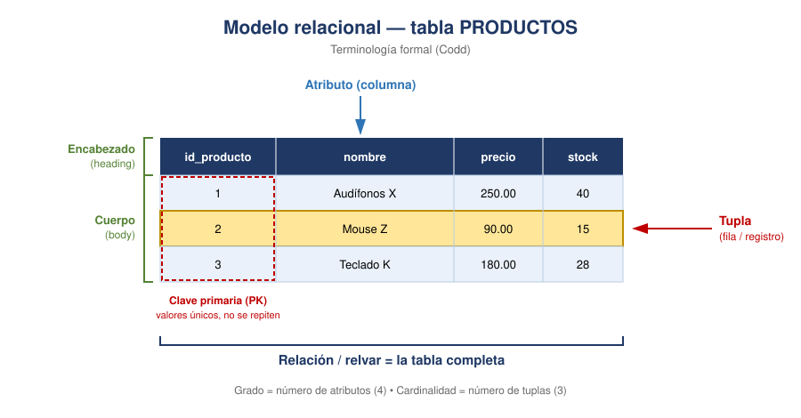

# Slides 12–13 · El modelo relacional

## Slide 12 — Origen

Propuesto por **Edgar F. Codd** en los **años 70**, mientras trabajaba en IBM. Su idea: los
datos se organizan en **tablas** compuestas de **filas y columnas**, y las conexiones entre
tablas se hacen por **valores**, no por punteros físicos.

Eso es lo que hoy damos por obvio y en su momento fue revolucionario: el usuario deja de
navegar la estructura y pasa a **describir lo que quiere**. De ahí nace SQL.

*(Esta es la respuesta de la pregunta 3 del cuestionario.)*

## Slide 13 — Terminología formal

| Término formal | Nombre cotidiano | Qué es |
|---|---|---|
| **Relación** | Tabla | La estructura completa |
| **Relvar** | Nombre de la tabla | La *variable de relación*: el contenedor con nombre |
| **Atributo** | Columna / campo | Una característica de la entidad |
| **Tupla** | Fila / registro | Una instancia concreta |
| **Heading** (encabezado) | Fila de títulos | El conjunto de atributos y sus tipos |
| **Body** (cuerpo) | Las filas de datos | El conjunto de tuplas |
| **Grado** | — | Cantidad de **atributos** (columnas) |
| **Cardinalidad** | — | Cantidad de **tuplas** (filas) |
| **Clave primaria (PK)** | — | Atributo que identifica de forma única cada tupla |

## Aviso importante sobre la palabra "relación"

Esta palabra tiene **dos significados distintos** y es la fuente número uno de confusión:

- En el **modelo relacional de Codd**, una *relación* **es la tabla misma**.
- En el **modelo entidad-relación**, una *relación* es el **vínculo entre dos entidades**.

Dicho de otro modo: el modelo relacional no se llama así por las conexiones entre tablas,
sino porque su unidad básica se llama *relación*. Merece una diapositiva mental propia,
porque los alumnos arrastran esa confusión hasta el final del curso.

## Para clase

Proyecta la tabla PRODUCTOS y haz tres preguntas rápidas: ¿cuál es el grado?, ¿cuál es la
cardinalidad?, ¿cuál es la clave primaria? Son treinta segundos y fijan el vocabulario mejor
que cinco minutos de definiciones.
