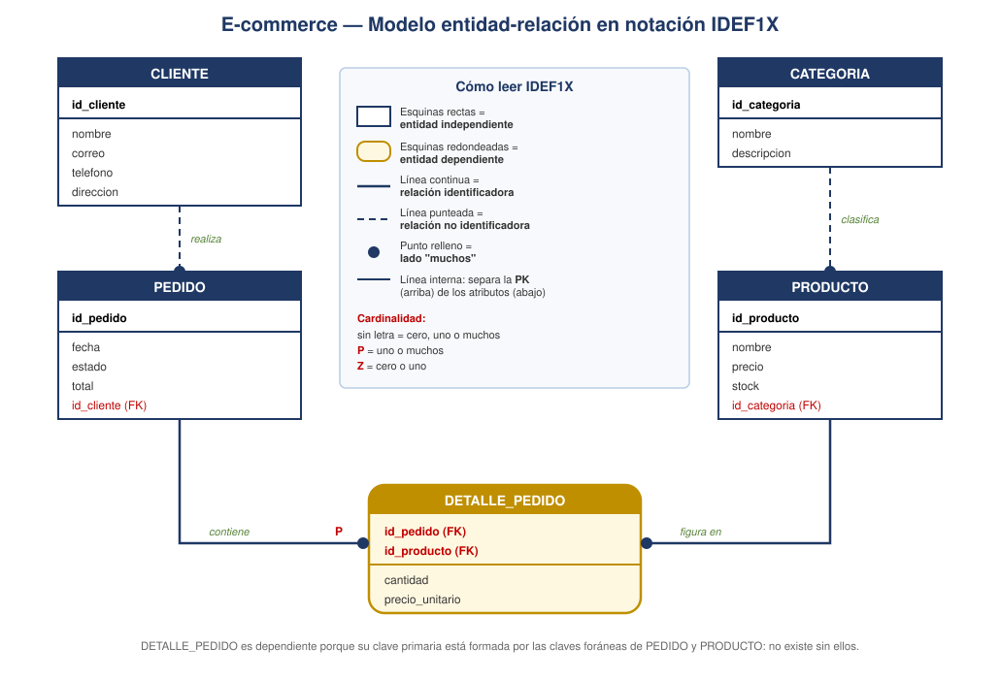

# Slide 14 · Modelo entidad-relación (MER)

El MER es una herramienta de **diseño conceptual**: sirve para dibujar la realidad antes de
crear una sola tabla. Es de **alto nivel** e **independiente del almacenamiento**: no dice
nada sobre archivos, discos ni SGBD.

*(Esa frase es exactamente la respuesta de la pregunta 10 del cuestionario.)*

## Sus tres elementos

**Entidad.** Un objeto o concepto del mundo real sobre el que queremos guardar información:
Cliente, Producto, Pedido. Se dibuja como un rectángulo.

**Atributo.** Una característica de la entidad: nombre, precio, stock. Uno de ellos es el
**identificador** (la futura clave primaria).

**Relación.** El vínculo entre dos entidades: *un cliente **realiza** un pedido*. Se
acompaña de su **cardinalidad**: 1:1, 1:N o N:M.

## Dos aclaraciones que siempre hacen falta

**1. Entidad vs. tabla.** Son la misma cosa en dos momentos distintos. En el **diseño** se
llama *entidad*; cuando la implementas en el SGBD se llama *tabla* (o *relación*). No son
conceptos rivales: es el mismo objeto antes y después de nacer.

**2. Cómo se materializa una relación.** En el diagrama la relación es una línea. En la base
de datos real esa línea se convierte en una **clave foránea**: la tabla del lado "muchos"
guarda una columna con el identificador de la tabla del lado "uno".

```
CLIENTES.id_cliente  (PK, valor 7)
        ↑
PEDIDOS.id_cliente   (FK, valor 7)  →  este pedido es de Ana
```

El mecanismo es simplemente **coincidencia de valores**: el SGBD sabe que el pedido 1024 es
de Ana porque su columna `id_cliente` vale 7, igual que la clave primaria de Ana. Nada de
punteros ni de posiciones en disco.

---

## Las cuatro notaciones

El slide muestra que un mismo modelo se puede dibujar de cuatro maneras. Vale la pena
mostrar las cuatro con **el mismo caso** para que vean que cambia el dibujo, no el modelo.

### Notación UML



Clases con atributos y multiplicidades (`1`, `0..*`, `1..*`). Es la que se usa en ingeniería
de software porque se integra con el resto de diagramas UML.

### Notación pata de gallo (crow's foot)



La más usada en herramientas de modelado. La "patita" de tres líneas significa *muchos*; el
trazo perpendicular, *uno*; el círculo, *cero* (opcional).

### Notación Chen



La original de Peter Chen (1976), la más académica: **rectángulos** para entidades,
**rombos** para relaciones y **óvalos** para atributos. Su ventaja didáctica es que hace
visible algo que las otras esconden: la relación *contiene* tiene sus **propios atributos**
(cantidad, precio_unitario), y por eso terminará convirtiéndose en la tabla
`DETALLE_PEDIDO`.

### Notación IDEF1X



Estándar de origen militar/industrial en EE. UU. Distingue entidades **independientes**
(esquina recta) de **dependientes** (esquina redondeada), y relaciones identificadoras
(línea continua) de no identificadoras (línea punteada).

## Para clase

Muestra las cuatro versiones del mismo modelo sin decir nada y pregunta: *"¿son cuatro bases
de datos distintas?"*. Casi siempre alguien dice que sí. Ahí aterrizas la idea de que la
notación es un idioma, no un modelo.
