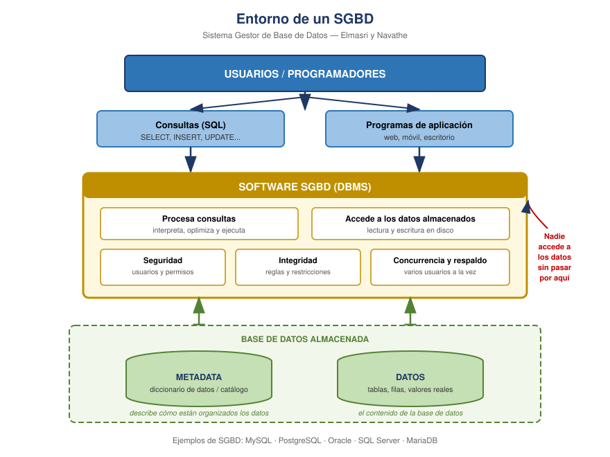

# Slides 15–16 · El SGBD y su entorno

Según **Elmasri y Navathe**. Un **Sistema de Gestión de Base de Datos (SGBD)** es el
software que permite **definir, construir, manipular y compartir** bases de datos entre
distintas aplicaciones y usuarios.

*(Esa cuádruple es literalmente la respuesta de la pregunta 5 del cuestionario.)*

## El entorno, capa por capa

De arriba hacia abajo, que es el orden que funciona en clase:

**1. Usuarios.** Nunca tocan los datos directamente. Lanzan consultas SQL o usan una
aplicación.

**2. Consultas y programas de aplicación.** Las dos vías de entrada. Un analista escribe
SQL a mano; un cliente de la tienda solo pulsa "Comprar" y la app arma la consulta por él.

**3. Software SGBD.** El corazón. Recibe la petición, la interpreta, la **optimiza**,
verifica **permisos** e **integridad**, coordina a los usuarios **concurrentes**, y recién
entonces baja al disco.

**4. Almacenamiento.** Dos cosas distintas y conviene no mezclarlas: la **metadata** (la
descripción de cómo están organizados los datos: qué tablas hay, qué columnas, qué tipos) y
los **datos** propiamente dichos.

## El punto que vale la pena martillar

**Nadie llega a los datos sin pasar por el SGBD.** De esa única flecha se derivan todas sus
funciones: si el SGBD es el único portero, entonces él es quien puede exigir credenciales,
hacer cumplir las reglas de integridad y evitar que dos usuarios se pisen.

**Analogía:** el SGBD es el bibliotecario. Tú no entras al depósito a buscar el libro; se lo
pides y él te lo trae, controlando quién puede llevarse qué.

## SGBD más conocidos

MySQL, PostgreSQL, Oracle Database, Microsoft SQL Server, MongoDB (documental), Neo4j
(grafos).

---

## Preguntas que surgieron

### ¿Motor de base de datos y SGBD son lo mismo?

No exactamente. **El motor es una parte del SGBD.**

- El **SGBD** es el paquete completo: interfaz de consultas, herramientas de administración,
  seguridad, respaldos.
- El **motor** (*database engine*) es el componente interno que ejecuta el trabajo pesado:
  procesa consultas, lee y escribe en disco, gestiona transacciones y concurrencia.

**Analogía:** el SGBD es el auto completo, con tablero, asientos y controles. El motor es lo
que va bajo el capó. Tú manejas el auto entero, pero quien mueve todo es el motor.

**Ejemplo concreto:** en SQL Server, el producto es el SGBD y por dentro tiene el
*SQL Server Database Engine*. En MySQL es aún más claro, porque puedes elegir entre motores
como **InnoDB** o **MyISAM** y cambiar de motor sin cambiar de SGBD.

### Si los datos no están dentro del SGBD, ¿dónde están?

**En archivos físicos del disco duro del servidor.** El SGBD es un programa instalado; los
datos son archivos aparte. El SGBD sabe dónde están, cómo leerlos y cómo escribirlos, pero
son entidades separadas.

En SQL Server esos archivos son los de los slides 25 a 29: el **.MDF** (datos) y el
**.LDF** (registro de transacciones).

El flujo real: pides algo al SGBD → el SGBD va a esos archivos en disco → lee o escribe →
te devuelve el resultado.

**Volviendo a la analogía:** el bibliotecario no guarda los libros en el cuerpo. Están en
los estantes (el disco). Él sabe en qué estante está cada uno y va por ellos cuando se los
pides.

## Puente al siguiente slide

Pregunta de cierre: *"¿y cómo hace el SGBD para asegurarse de que nadie meta datos
incorrectos?"*. La respuesta es la integridad de datos, que es justo el slide 17.
