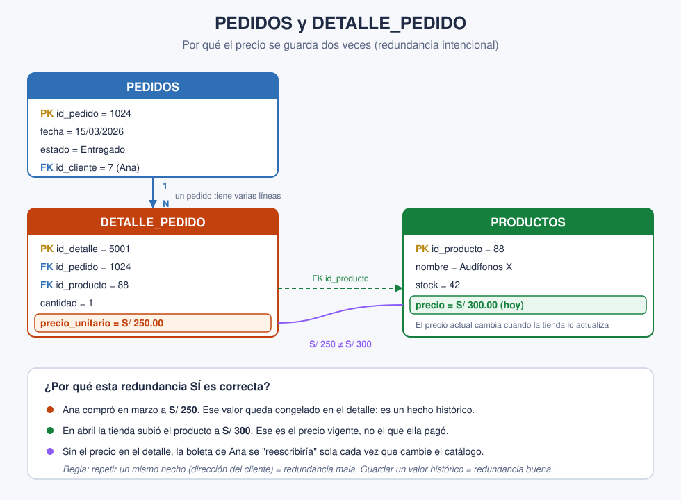

# Slide 19 · Redundancia de datos

La redundancia ocurre cuando el **mismo dato se repite** innecesariamente en varios lugares
de la base.

## Los dos problemas que trae

**1. Desperdicio de espacio.** Guardas la misma información muchas veces sin necesidad.

**2. Riesgo de inconsistencia** — y este es el grave. Si el dato cambia, hay que
actualizarlo en **todos** los lugares donde está copiado. Si te olvidas de uno, terminas con
versiones que se contradicen.

## El ejemplo del e-commerce

Imagina que guardas el nombre y la dirección del cliente **dentro de cada pedido**. Si Ana
tiene diez pedidos, su dirección está copiada diez veces. Cuando se mude, tendrás que
corregir diez registros; si corriges nueve, ya tienes datos inconsistentes.

**La solución** es el buen diseño relacional: la dirección vive **una sola vez** en
`CLIENTES`, y los pedidos la referencian con la clave foránea. *Un dato, un solo lugar.*

---

## Cuándo la redundancia SÍ es correcta

Acuérdate de que el slide 9 decía "sin redundancias **perjudiciales**", no "sin
redundancia". Hay un caso clásico en el que repetir es lo correcto: el **precio en el
detalle del pedido**.

El precio ya está en `PRODUCTOS`, así que copiarlo en `DETALLE_PEDIDO` parece redundante. Y
sin embargo es **necesario**, porque el precio **cambia con el tiempo**:

- Ana compró los Audífonos X en **marzo a S/ 250**.
- En abril la tienda los subió a **S/ 300**.
- Si el detalle solo apuntara al precio actual, la boleta de Ana mostraría S/ 300, un precio
  que ella nunca pagó.

Por eso el precio se guarda **congelado** en el momento de la compra. Son dos cosas
distintas: `PRODUCTOS.precio` es *cuánto cuesta hoy*; `DETALLE_PEDIDO.precio_unitario` es
*cuánto se pagó ese día*.

## La regla para los alumnos

> La redundancia es **mala** cuando copias el **mismo hecho** que debería ser único
> (la dirección del cliente).
> Es **válida** cuando capturas un **valor histórico**, una foto de un momento que debe
> conservarse aunque el original cambie.

## Para clase

Funciona muy bien como pregunta trampa: muéstrales solo las dos tablas y pregunta si eso es
redundancia mala. Casi todos dirán que sí. Entonces cambias el precio del producto en vivo y
que vean qué le pasaría a la boleta de Ana.
