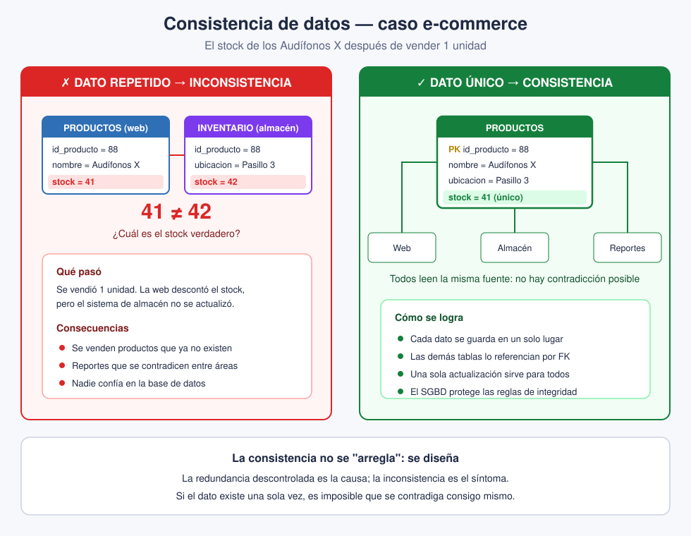

# Slide 20 · Consistencia de datos

La consistencia significa que un mismo dato debe tener el **mismo valor en todos los
lugares** donde aparezca. Cuando la información se contradice entre una parte y otra de la
base, se dice que está **inconsistente**.

**Relación con el slide anterior:** la redundancia es la **causa**, la inconsistencia es el
**síntoma**. Cuando repites datos sin control, tarde o temprano las copias dejan de
coincidir.

## El caso del slide: RR. HH. vs. Contabilidad

Un empleado actualiza su dirección (o su sueldo). Recursos Humanos registra el cambio en su
sistema, pero Contabilidad sigue con el dato viejo porque usa otra base. Ahora el mismo
empleado tiene **dos valores distintos** según a qué área le preguntes.

¿Cuál es el verdadero? **Nadie lo sabe con certeza.** Ese es exactamente el problema: la
base perdió su condición de fuente de verdad.

*(Este caso reaparece tal cual en la pregunta 7 del cuestionario.)*

## Llevado al e-commerce

Si el stock se guarda en dos sitios —el sistema de la tienda y el del almacén— y solo
actualizas uno cuando hay una venta, terminarás con **41 en un lado y 42 en el otro**.
Consecuencia práctica: vendes productos que ya no tienes, o retienes productos que sí están
disponibles.

## La lección de fondo

La consistencia se logra **atacando la redundancia de raíz**. Si guardas cada dato en **un
solo lugar**, sencillamente no hay forma de que se contradiga consigo mismo. Por eso el buen
diseño relacional es la mejor defensa contra la inconsistencia.

## Para clase

Muestra primero solo los dos números (41 y 42) y pregunta cuál es el correcto. La respuesta
honesta es que **no se puede saber**. Recién ahí muestras el panel del dato único. El
impacto pedagógico está en que sientan la incomodidad antes de recibir la solución.
