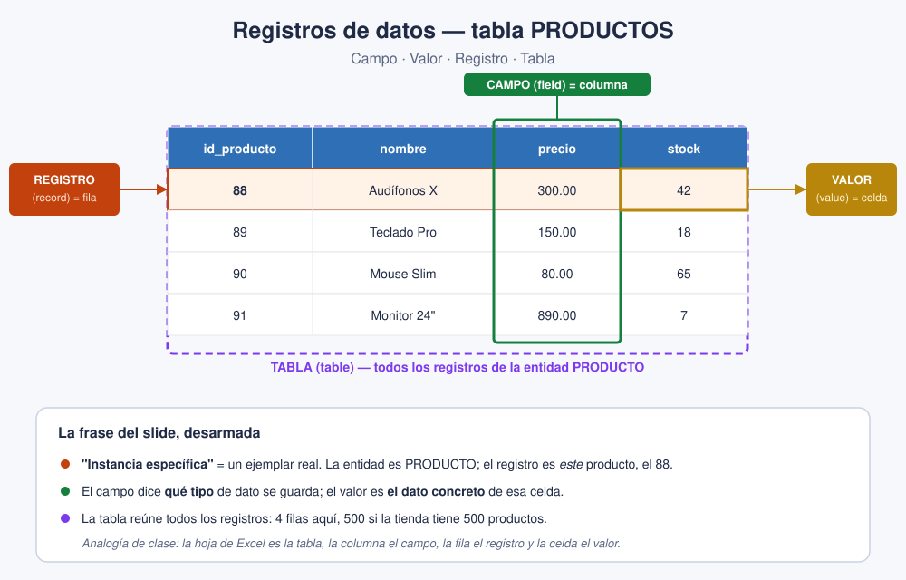

# Slides 22–23 · Registros de datos

## La frase clave del slide

> Un **registro de datos** es una **fila completa** dentro de una tabla, y representa
> **una instancia específica** de una entidad.

Vale la pena desarmarla. La **entidad** es el concepto general (Cliente, Producto, Pedido);
el **registro** es un ejemplar concreto de esa entidad. Si la entidad es Cliente, un
registro es Ana Torres con su correo, su teléfono y su dirección; otro registro es Luis Paz
con los suyos. Cada fila es un cliente real: una **instancia**.

## Las cuatro piezas que conviene distinguir

| Término | En inglés | Qué es | Ejemplo |
|---|---|---|---|
| **Campo** | *field* | Una columna: dice **qué tipo** de dato guardas | `nombre` |
| **Valor** | *value* | El dato concreto de una celda | `Audífonos X` |
| **Registro** | *record* | La **fila completa** | `88, Audífonos X, 300, 42` |
| **Tabla** | *table* | El conjunto de todos los registros | `PRODUCTOS` |

## La analogía que siempre funciona

Piensa en una hoja de cálculo:

- La **columna** es el campo (dice qué tipo de dato guardas).
- La **fila** es el registro (una entidad completa).
- La **celda** es el valor.
- La **hoja** entera es la tabla.

## Aplicado al e-commerce

En la tabla `PRODUCTOS`, un registro es *"el producto 88, Audífonos X, precio 300,
stock 42"*. Toda esa fila junta es **una instancia** de la entidad Producto. Si la tienda
tiene 500 productos, hay 500 registros en esa tabla.

## Para clase

Señala la fila resaltada del diagrama y pregunta simplemente: *"¿qué es esto?"*. Si responden
"un producto", ya entendieron lo de la instancia. La palabra "registro" es solo el nombre
técnico de algo que ya intuyen; no hace falta que la memoricen antes de entenderla.
