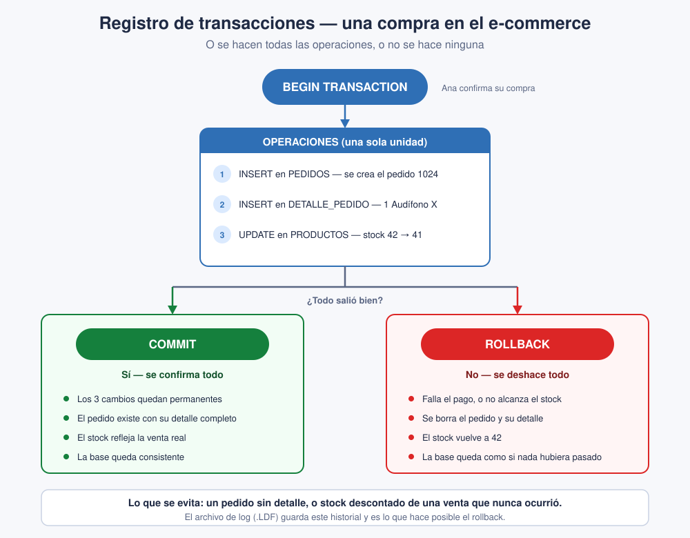

# Slide 24 · Registro de transacciones

## Qué es una transacción

Un **conjunto de operaciones que se ejecutan como una sola unidad indivisible**. O se hacen
**todas**, o no se hace **ninguna**. No hay términos medios.

## El ciclo del slide

- **BEGIN** — marca el inicio de la transacción.
- **TRANSACTION** — las operaciones que se quieren realizar.
- **COMMIT** — confirma y guarda todos los cambios de forma permanente.
- **ROLLBACK** — deshace todo y deja la base tal como estaba antes de empezar.

Las dos últimas son las dos únicas salidas posibles: la transacción siempre termina en una o
en la otra.

## El ejemplo clásico: la transferencia bancaria

Pasas S/ 100 de una cuenta a otra. Son dos operaciones: restar de una y sumar en la otra.
Si se resta el dinero y el sistema falla antes de sumarlo, el dinero **desaparecería**. Con
la transacción, el ROLLBACK deshace el descuento y nadie pierde su plata.

*(Este es exactamente el escenario de la pregunta 9 del cuestionario.)*

## Aplicado al e-commerce

Cuando Ana confirma su compra pasan tres cosas juntas:

1. Se crea el registro en `PEDIDOS`.
2. Se guardan las líneas en `DETALLE_PEDIDO`.
3. Se descuenta el stock en `PRODUCTOS` (42 → 41).

Eso es **una sola transacción**. Si el stock no alcanza o algo falla, el ROLLBACK cancela
todo: no queda un pedido a medias sin su detalle, ni stock descontado por una venta que
nunca se concretó. **O se completa toda la compra, o no pasa nada.**

## Para clase

Plantéalo al revés: pregúntales qué pasaría si el sistema se cayera **justo después de la
operación 2**. La respuesta ingenua es "queda el pedido registrado", y ahí les muestras el
desastre: pedido creado con stock intacto, o al revés. La transacción existe precisamente
para que ese estado intermedio **nunca sea visible**.

## Puente al bloque físico

¿Dónde se guarda la información que hace posible el ROLLBACK? En el **archivo de log**
(**.LDF**), que es justo el tema de los slides 25 y 28. Es la transición más natural de todo
el bloque.
